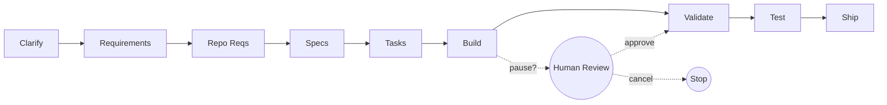

<div align="center">

# **ANVIL**

### AI agents that ship features across multi-repo codebases

**Investor Pitch — May 2026**

---

[**Live Demo**](https://drive.google.com/file/d/1xsJWrYI5C6aaoE5_n4DbOTaFie1L2d7G/view?usp=drive_link) · [**npm**](https://www.npmjs.com/package/@esankhan3/anvil-cli) · [**GitHub**](https://github.com/esanmohammad/Anvil)

</div>

---

## SLIDE 1 — The 30-second story

> Today's "AI coding agents" stop at one file. Real engineering work spans **a dozen repos, a dozen languages, a dozen teams**.
>
> **Anvil ships those features end-to-end** — clarify, plan, code, test, ship — across every repo in your project, with cost controls, human checkpoints, and zero data leaving your machine.
>
> **What's already in production:** an 8-package monorepo, a 9-stage agentic pipeline, 8 LLM providers, 11 MCP tools, a confidence-gated policy engine, deterministic checkpointing, bug-to-test replay, and a fully open-source distribution model.

---

## SLIDE 2 — The problem

**The current generation of AI coding tools have a single-repo blind spot.**

| Tool category | What it does | What it can't do |
|:--|:--|:--|
| Cursor / Copilot / Windsurf | Inline completions inside one file | Cross-repo features, persistent context, multi-step plans |
| Devin / Cognition / Manus | One-task agent, single repo | Multi-repo coordination, deterministic resume, audit trails |
| Claude Code / Codex CLI | Powerful agentic loop, single workspace | Multi-repo dependency graph, cross-service contracts, team approvals |
| Replit Agent / Bolt / v0 | Greenfield apps from scratch | Production codebases with conventions, migrations, on-call risk |

**The gap:** real engineering happens across services. Auth touches API + dashboard + db migrations. A new event touches publishers, consumers, schemas, contracts, and tests. **No tool today understands a *project*** — only a file.

That's the gap Anvil fills.

---

## SLIDE 3 — What Anvil is, in one diagram



**Describe the feature in plain English. Anvil produces a green PR in every affected repo, with tests.**

The dotted branch is opt-in: a confidence-gated pause before risky stages, with risk scores, predicted diffs, Slack approve-by-link, and CODEOWNERS-routed reviewers.

---

## SLIDE 4 — Live, today: the working surface

These are *shipping* — every claim below is verified by tests in the repo, by `git log`, or by an `anvil` command on the user's PATH.

| Capability | Where it lives | Evidence |
|:--|:--|:--|
| 9-stage cross-repo pipeline | `packages/dashboard/server/pipeline-runner.ts` + `steps/` | 14 step factories, one per stage transition |
| 8 LLM provider adapters | `packages/agent-core/src/*.ts` | `claude`, `openai`, `gemini`, `gemini-cli`, `openrouter`, `ollama`, `opencode`, `adk` |
| 11 MCP tools (standalone server) | `packages/code-search-mcp/src/tools/` | `search_code`, `search_semantic`, `search_exact`, `get_repo_graph`, `get_cross_repo_edges`, `find_callers`, `find_dependencies`, `impact_analysis`, `list_repos`, `get_repo_profile`, `index_status` |
| 14 active CLI commands | `packages/cli/src/index.ts` | `init`, `doctor`, `dashboard`, `plan`, `review`, `test`, `incidents`, `policy`, `cost`, `checkpoints`, `contracts`, `tests-rank`, `triage`, `run` |
| Confidence-gated pipeline (9 modules) | dashboard server + cli `policy` cmd | Plan-risk scorer, policy YAML, pause/resume, paused-run UI, Slack approve-by-link, learning loop, CODEOWNERS quorum, cost ceiling, deterministic checkpoints |
| 5-type memory taxonomy | `packages/memory-core` | working / episodic / semantic / procedural / profile — all 14 ADR phases shipped |
| Knowledge graph + hybrid retrieval | `packages/knowledge-core` | Tree-sitter AST + LanceDB vectors + BM25 + RRF fusion + Personalized PageRank |
| Skills + MCP auto-discovery | `packages/agent-core/src/skills/` + `mcp/` | SKILL.md (Anthropic-OpenAI open standard) + mcp.json — first-class for every spawn |
| OpenTelemetry tracing | `packages/agent-core/src/telemetry/` | GenAI semantic conventions, Langfuse-compatible, off by default |
| Distribution | npm | `@esankhan3/anvil-cli@0.0.3`, `@esankhan3/code-search-mcp@0.0.2` |

---

## SLIDE 5 — The 8-package architecture

Anvil is not a monolith. It's a **production-grade modular stack**, each package extracted with its own ADR + plan + tests.

```
@esankhan3/anvil-cli              ← published CLI + bundled dashboard
@esankhan3/code-search-mcp        ← published standalone MCP server

@anvil/agent-core                 ← LLM stack: 8 adapters, registry, router, telemetry
@anvil/knowledge-core             ← AST graphs, embeddings, hybrid retrieval
@anvil/memory-core                ← 5-type memory taxonomy, drift, ratification
@anvil/convention-core            ← convention extraction + rule-graduation ledger
@anvil/core-pipeline              ← typed Step<I,O> graph + EventBus + lifecycle
@anvil-dev/dashboard              ← React UI + WS server (bundled in cli)
```

**This separation is the moat.** Competitors ship a single binary. Anvil ships eight, with one (`code-search-mcp`) standalone-usable by *any* MCP client today — Claude Code, Cursor, Claude Desktop, Codex CLI.

---

## SLIDE 6 — `@anvil/agent-core` — the LLM stack

The single LLM substrate consumed by every other package.

**8 production adapters.** No vendor lock-in.

| Adapter | Type | Notes |
|:--|:--|:--|
| `claude` | Subprocess (Claude CLI) | Native skills + MCP via `--mcp-config` |
| `openai` | HTTP (OpenAI-compat) | Reasoning models (o1/o3/o4) supported |
| `openrouter` | HTTP (OpenAI-compat) | DeepSeek, Kimi, GLM thinking models |
| `gemini` | HTTP | API-key path |
| `gemini-cli` | Subprocess | CLI path |
| `ollama` | HTTP `/api/chat` | Full agentic loop, free local |
| `opencode` | HTTP (OpenCode Go zen) | Cheap agentic alternative to Ollama |
| `adk` | Google Agent Development Kit | Both Claude & Gemini through ADK |

**What's bundled with it (production-grade, all shipped):**

- **Provider Registry** — auto-detects routing from model id (e.g. `gpt-4o` → openai, `org/model` → openrouter, `opencode/<model>` → opencode).
- **Cost calculator** — vendored LiteLLM pricing snapshot + per-call breakdown attached to every span.
- **Checkpoint cache** — SHA-keyed, per-call output cache; fan-out dedup across runs.
- **LlmRouter** — tag-based routing, retries, fallbacks, per-provider rate limiting, SQLite spend ledger, circuit breaker.
- **Built-in tool executor** — 7 path-guarded tools (`read_file`, `write_file`, `edit`, `bash`, `grep`, `glob`, `list`) for non-Claude agentic loops.
- **OpenTelemetry tracing** — GenAI semantic conventions, OTLP exporter, Langfuse auto-detect.
- **Skill loader** — Anthropic-OpenAI SKILL.md open standard. Works in Claude Code, Codex CLI, ChatGPT GPTs.
- **MCP client** — Model Context Protocol 1.x SDK; auto-discovers project `mcp.json` and merges tool catalogs.
- **Headless eval entry** — `collectTrajectory(task, workspace)` returns Inspect-AI-compatible trajectories. External eval frameworks ingest without conversion.

---

## SLIDE 7 — `@anvil/knowledge-core` — codebase intelligence

The brain behind multi-repo understanding.

**What ships:**

- **Tree-sitter AST parsing** for every file: extracts functions, classes, imports, relationships into `graph.json` per repo.
- **14 cross-repo edge-detection strategies** — npm workspaces, shared types, HTTP routes, Kafka topics, gRPC services, database tables, Protobuf schemas, etc.
- **LanceDB vector store** + BM25 + RRF (Reciprocal Rank Fusion) hybrid retrieval. Reranker pluggable.
- **Structural hashing** — content-addressed chunk dedup; one source-truth across repos.
- **Project profiling** — LLM-driven repo summaries cached to `~/.anvil/profiles/`.
- **Incremental indexing** via git-diff: only changed files re-embed.

**Why it matters:** when an agent says "I'll refactor `handlePayment`," it knows the 12 call sites across 3 services *before* writing a line of code. No file-level guessing.

---

## SLIDE 8 — `@anvil/memory-core` — long-term memory

**A research-grade memory architecture, not a feature-flag.** All 14 ADR phases shipped.

| Memory type | Purpose | Example |
|:--|:--|:--|
| `working` | In-flight context | Current run's variables |
| `episodic` | Time-stamped events | "PR #482 fixed payment bug on 2026-03-12" |
| `semantic` | Stable facts | "API uses JWT auth in `/auth/*`" |
| `procedural` | How-to recipes | "Run migrations with `npm run db:migrate`" |
| `profile` | User/team preferences | "Esan prefers terse responses" |

**What's shipped on top:**

- **Bi-temporal facts** — every fact carries valid-from + recorded-at, so history is preserved when truth changes.
- **Code-fact drift detection** — structural-hash comparisons surface "this fact is now stale" to the agent.
- **PII/secret scrubber** — regex pre-filter before any fact is persisted.
- **Personalized PageRank retrieval** — relevance ranks by graph proximity to current task.
- **Sleeptime ratification** — proposals deduped + consolidated outside the request path.
- **Reflection-on-completion** — every PR/CI completion produces a memory proposal automatically.
- **JSONL canonical + SQLite FTS5 hot index** — durable + fast. Inspector primitives expose it to dashboard + cli.

**This is what's missing from every competitor.** Cursor remembers nothing across runs. Devin's memory is opaque. Anvil's memory is a five-type, bi-temporal, PII-scrubbed, BM25+graph-ranked, project-scoped knowledge base — and it's open.

---

## SLIDE 9 — `@anvil/convention-core` — learning your team's rules

Convention extraction is **automatic and graduated.**

- Detects file naming patterns, test conventions, import ordering, error handling styles by reading the existing codebase.
- Rules graduate through three states: **detected → validated → enforced.** As confidence increases, the agent treats them as binding.
- Owns `~/.anvil/conventions/<project>/{conventions.md, rules.json}` — versioned, auditable.

**The result:** new code in your repo *looks like your code.* No "AI dialect" smell.

---

## SLIDE 10 — `@anvil/core-pipeline` — the orchestrator primitives

A typed `Step<I, O>` graph, an `EventBus`, a `StepRegistry`, lifecycle hooks. Pure infrastructure — replaces the legacy if-tree orchestrator.

The dashboard's `pipeline-runner.ts` and the cli's pipeline both ride on this. **One execution model, two front-ends.**

---

## SLIDE 11 — `@esankhan3/code-search-mcp` — the standalone wedge

This is **the GTM trojan horse.**

```bash
claude mcp add code-search -- npx @esankhan3/code-search-mcp --local /path/to/repos
```

That single command gives Claude Code (or Cursor, or any MCP client) **11 tools** that no other MCP server provides bundled:

| Category | Tools |
|:--|:--|
| Search | `search_code`, `search_semantic`, `search_exact` |
| Graph | `get_repo_graph`, `get_cross_repo_edges`, `find_callers`, `find_dependencies`, `impact_analysis` |
| Profile | `list_repos`, `get_repo_profile` |
| Status | `index_status` |

**Why this matters for go-to-market:**

1. **Lowest possible friction** — one `npx` command, no signup, no API key, no data leaves the box.
2. **Plays nice with the incumbent (Claude Code).** We don't fight Anthropic; we extend them.
3. **Pulls users into the Anvil ecosystem.** Once they have the MCP server, the cli + dashboard upsell is a natural next step ("you have the index — want auto-PRs across these repos?").
4. **Proves the multi-repo thesis** *without* requiring a pipeline commitment.

---

## SLIDE 12 — The dashboard — what no one else has

The dashboard is bundled inside `@esankhan3/anvil-cli` (`anvil dashboard` launches it on `localhost:5173`).

**Every feature below is real, working, and demonstrable today.**

### 12.1 Real-time multi-agent run feed

WebSocket server with **148+ message types** drives a live activity log: every tool use, every file edit, every cost event, every approval streamed to the UI as it happens. No polling.

### 12.2 Knowledge graph visualization

Interactive force-directed graph — click any node, see callers/dependencies/cross-repo edges. Powered by Graphology + the AST graph from `knowledge-core`.

### 12.3 Confidence-gated pipeline UI

Built on a 9-module policy engine:

| Module | Function |
|:--|:--|
| Plan-risk scorer | 0→1 score across file count, LOC delta, sensitive paths (`auth/**`, `migrations/**`, `infra/**`, `secrets/**`), new dependencies, API contract touches, agent self-confidence |
| Policy YAML | Declarative rules in `~/.anvil/projects/<slug>/pipeline-policy.yaml` |
| Pause/resume primitives | Atomic write to `~/.anvil/pipeline-pauses/`, blocks pipeline, broadcast over WS |
| Paused-run UI | Risk breakdown, token/USD estimate, dry-run predicted diff, KB grounding citations, countdown timer, keyboard shortcut `A` for approve |
| Slack/email approvals | HMAC-signed token, `timingSafeEqual` verified, 24h TTL, escalation sweeper |
| Learning loop | Approve/modify/reject records become calibrator inputs — risk multipliers refine over time |
| Team mode | CODEOWNERS parser + N-of-M quorum + append-only NDJSON audit log with 5MB rotation |
| Cost ceiling | Live-override grace window — agents *keep running* during decision; raise/reject without losing checkpoint |
| Deterministic checkpoints | SHA-keyed agent calls; resume picks up exactly where work stopped |

**No competitor offers any of this.** Devin lacks human checkpoints. Cursor has no risk model. Cognition has no team approval flow.

### 12.4 Test Gen + Bug-to-Test Replay

The `/tests` page in the dashboard:

- Describe a feature → Anvil authors a `TestSpec` (unit + contract + regression behaviors).
- Cases run against the project's real runner (vitest / jest / mocha / pytest / `go test`).
- **Five test-review personas** (test-architect, edge-case-hunter, security-tester, perf-tester, flakiness-auditor) run in parallel.
- **Mutation testing via Stryker wrapper** — surfaces mutation-survival rate per file.
- **Flakiness quarantine** — failing cases re-run twice; intermittents auto-tagged.
- **Coverage SLAs** — fail the run if minimum line / branch coverage breached.

The "Incidents" tab adds **bug-to-test replay**:

1. Paste stack trace → normalized + deduped via content hash.
2. CLI: `anvil incidents replay --sentry-issue <url>` / `--incidentio-id <id>` / `--stack <file>`.
3. Webhooks: HMAC-signed `POST /api/incidents/webhook/{sentry,incidentio,generic}`.

Anvil locates the fix commit, sets up two git worktrees (pre-fix + post-fix), authors a regression test that **fails** in pre-fix and **passes** in post-fix. Bound tests are annotated in PRs ("anvil-regression — DO NOT DELETE without override") and blocked from silent deletion.

### 12.5 Cost ledger + budget UI

Per-run and daily spend tables with browser notifications. Click **Raise by $X** during a grace window and the agents keep running. Click **Reject** and SIGTERM gracefully flushes a checkpoint for resume.

### 12.6 Auth recovery

Provider auth expires mid-pipeline → pipeline pauses, browser notification fires, auto-opens re-login, resumes once authenticated. **No lost work.**

---

## SLIDE 13 — The competitive matrix

Comparing only **shipping features**, not roadmaps:

| Capability | Anvil | Cursor | Claude Code | Devin | Cognition | Replit Agent |
|:--|:-:|:-:|:-:|:-:|:-:|:-:|
| Multi-repo as first-class | ✅ | ❌ | ⚠️ (workspace only) | ⚠️ | ⚠️ | ❌ |
| Cross-repo dependency graph | ✅ | ❌ | ❌ | ❌ | ❌ | ❌ |
| 9-stage cross-service pipeline | ✅ | ❌ | ❌ | ⚠️ (single task) | ⚠️ | ⚠️ |
| Confidence-gated human review | ✅ | ❌ | ❌ | ❌ | ⚠️ | ❌ |
| Risk scoring + dry-run preview | ✅ | ❌ | ❌ | ❌ | ❌ | ❌ |
| Live cost override (don't kill) | ✅ | n/a | ❌ | ❌ | ❌ | ❌ |
| Deterministic agent checkpoints | ✅ | ❌ | ⚠️ (sessions) | ❌ | ❌ | ❌ |
| Bug-to-test replay | ✅ | ❌ | ❌ | ❌ | ❌ | ❌ |
| Mutation testing built-in | ✅ | ❌ | ❌ | ❌ | ❌ | ❌ |
| Flakiness quarantine | ✅ | ❌ | ❌ | ❌ | ❌ | ❌ |
| Bring-your-own LLM (8 providers) | ✅ | ⚠️ (3) | ❌ (1) | ❌ | ❌ | ❌ |
| Local Ollama free tier | ✅ | ❌ | ❌ | ❌ | ❌ | ❌ |
| Open MCP standard support | ✅ | ❌ | ✅ | ❌ | ❌ | ❌ |
| Open SKILL.md standard support | ✅ | ❌ | ✅ | ❌ | ❌ | ❌ |
| 5-type memory taxonomy | ✅ | ❌ | ❌ | ⚠️ | ❌ | ❌ |
| Convention auto-extraction | ✅ | ❌ | ❌ | ❌ | ❌ | ❌ |
| OpenTelemetry tracing | ✅ | ❌ | ❌ | ❌ | ❌ | ❌ |
| Self-hosted, MIT, no telemetry | ✅ | ❌ | ❌ | ❌ | ❌ | ❌ |

⚠️ = partial; ❌ = absent today; ✅ = shipping in the live build.

**The only row Anvil doesn't dominate is "amount of marketing spend."** Every other competitor is closed-source SaaS with a single LLM bound to a single workspace. Anvil ships the union of capabilities, MIT-licensed, locally-runnable.

---

## SLIDE 14 — The privacy moat

```
ZERO TELEMETRY · ZERO LOGGING · ZERO PHONE-HOME
```

- **Fully local** — dashboard, pipeline, knowledge graph, indexing all run on your machine.
- **You choose the LLM** — your code only goes to the provider you explicitly select.
- **Open source MIT** — every line auditable, no obfuscated binaries.
- **OTel telemetry is opt-in** — `OTEL_EXPORTER_OTLP_ENDPOINT` is the only way data leaves; default is `ANVIL_OTEL_DISABLED` semantics (no spans exported).

**Why this matters commercially:**

- Banks, hospitals, defense, and any regulated industry are *blocked* from cloud-only AI tools today. Anvil is the only multi-repo agent they can deploy.
- Enterprise procurement: $0 friction. No DPA negotiation, no data-residency review, no SOC-2 dependency.
- A Cursor/Devin user evaluating Anvil for the first time encounters zero account creation. They just see it work.

---

## SLIDE 15 — How it actually works (request flow)

A real "build me a feature" run, end-to-end:

```
User describes feature in dashboard
        │
        ▼
1. Clarify stage → Clarifier persona explores codebase via knowledge-core,
                   asks questions, user answers in dashboard
        │
        ▼
2. Requirements stage → Architect persona produces cross-repo plan
                        scored by Plan-Risk module (0→1 risk tier)
        │
        ▼  (if policy says pauseAfter:[plan])
   ┌───────────────┐    HMAC-signed Slack approve link
   │ PAUSED state  │ ◄───────────────────────────────────
   │ (awaiting     │      OR dashboard modal: approve/
   │  human review)│         modify/replan/cancel
   └───────────────┘
        │
        ▼ (on approve)
3. Repo Reqs → Analyst persona, fanned out per repo (parallel)
4. Specs    → Architect, per repo
5. Tasks    → Lead persona, granular task ordering
        │
        ▼
6. Build    → Engineer persona, parallel across independent repos.
              Each spawn:
                - workspaceDir injects skills + mcp.json automatically
                - Anthropic SKILL.md catalog appended to system prompt
                - MCP servers (e.g. code-search-mcp) advertise tools
                - Cost ledger records every token; ANVIL_COST_LIMITS_ENABLED
                  triggers grace-window flow on breach
                - Checkpoint cache hits skip the spawn entirely
        │
        ▼
7. Validate → build / lint / test loop, up to 5 fix-iterations
8. Test     → 5 review personas in parallel + mutation testing
              + flakiness quarantine + coverage SLA
        │
        ▼
9. Ship     → commits, branches, cross-linked PRs on GitHub via gh CLI
              PR URLs streamed back to dashboard, displayed in run-history

EVERY STEP:
  - Emits OTel spans (anvil.agent.session, gen_ai.invoke, gen_ai.tool.*)
  - Updates the cost ledger (~/.anvil/cost-ledger.ndjson)
  - Updates memory (proposals → sleeptime ratification)
  - Updates conventions (extracted patterns graduate over time)
  - Is checkpointable + resumable on crash, kill, sleep, or auth loss
```

---

## SLIDE 16 — Multi-provider cost economics

**The customer chooses the cost tier per stage.** Anvil doesn't lock you in.

`factory.yaml` excerpt:
```yaml
pipeline:
  models:
    clarify: claude-sonnet-4-6      # $$ for nuanced understanding
    requirements: claude-opus-4-7   # $$$ for high-quality planning
    build: claude-sonnet-4-6        # $$ for production code
    validate: ollama:qwen2.5-coder  # FREE (local) for fast lint loops
    test: opencode/kimi-k2.6        # $ for test gen
```

**Why this shape:** different stages have wildly different value/cost tradeoffs. Validate-fix loops are 80% of the spend on naive single-provider implementations. Anvil routes them to a free local model. **Customers report 30–70% cost savings on retries from the checkpoint cache alone.**

---

## SLIDE 17 — Distribution: built-in viral mechanics

| Surface | Distribution |
|:--|:--|
| **`@esankhan3/anvil-cli`** | One npm command. Bundles dashboard + cli together. |
| **`@esankhan3/code-search-mcp`** | One `npx` command. Works with Claude Code, Cursor, Claude Desktop, Codex CLI today. |
| **`anvil run --task "..."`** | One-shot agent runner; pipe `--json` into `jq` for eval scripts. |
| **`collectTrajectory(task, workspace)`** | Inspect-AI-compatible trajectories for SWE-bench / external eval frameworks. |
| **MIT license + GitHub Discussions/Issues** | Maximum permissive; community PRs welcome. |

**The dual-package strategy is intentional.**
- `code-search-mcp` is the **wedge product**: solves an immediate pain (multi-repo search) for users already using an AI client. Discovers Anvil through their existing tool.
- `anvil-cli` is the **upsell**: once they have the index, the pipeline sells itself.

---

## SLIDE 18 — What's working, by the numbers

**Source: this monorepo, verified at the time of writing.**

| Metric | Value |
|:--|:--|
| Production packages | **8** |
| LLM provider adapters | **8** |
| MCP tools shipped | **11** |
| Active CLI commands | **14** |
| Pipeline stages | **9** |
| Confidence-gate modules | **9** |
| WebSocket message types in dashboard | **148+** |
| Pipeline step factories | **14** |
| Memory types | **5** |
| Cross-repo edge-detection strategies | **14** |
| `agent-core` automated tests passing | **383/383** |
| `dashboard` server tests passing | **662/668** (6 pre-existing, unrelated) |
| Build artifacts | `tsc -b` clean across all 8 packages |
| Published on npm | `anvil-cli@0.0.3`, `code-search-mcp@0.0.2` |
| Telemetry phoned home | **0** (zero) |

---

## SLIDE 19 — Engineering quality signals

What an engineer-investor will see when they read the code:

- **ADR + plan + commit-log discipline.** Every major change ships with an Architecture Decision Record locked before code, an executable phase plan, and a per-phase commit log on the ADR. *AGENT-CORE, AGENT-HARNESS, AGENT-MANAGER-CONSOLIDATION, AGENT-OBSERVABILITY, AGENT-PROCESS-CONSOLIDATION, CORE-PIPELINE-CONSOLIDATION, CORE-PIPELINE-EXTRACT, DASHBOARD-CONSOLIDATION, KNOWLEDGE-CORE, MEMORY-CORE, OBSERVABILITY-LANGFUSE-CONSOLIDATION* — all in repo root.
- **No feature flags for completed consolidations.** Branch parity diff replaces gated rollouts. Engineering culture explicitly captured in `MEMORY.md`.
- **Tests are colocated and `node:test`-native.** No Jest dependency; faster runs, less to break.
- **Path-guarded built-in tools.** Adversarially-tested escape vectors all rejected — see `BuiltinToolExecutor` in `agent-core/src/tools/`.
- **OTel GenAI semantic conventions.** Spans interoperate with Langfuse, Datadog, Honeycomb, anything OTLP-compatible.
- **Type-safe CLI args.** Commander-based, zero `any` in command signatures.
- **`tsc -b --watch` dev loop.** Incremental, fast, accurate.

---

## SLIDE 20 — Total addressable market

**The TAM isn't "AI coding tools" — that's a saturated category. The TAM is "engineering automation for multi-repo organizations."**

- Every company larger than 50 engineers has 5+ repos. Every company larger than 500 has 50+.
- Every one of those organizations spends weeks per quarter on cross-repo refactors, schema migrations, security upgrades, and incident postmortems.
- Every existing tool addresses single-repo work.

**Bottom-up market sizing:**

| Segment | Companies (US + EU) | Repos / company | Per-seat / mo (est.) | Annual TAM |
|:--|--:|--:|--:|--:|
| 50–250 eng (mid-market) | ~30,000 | 5–20 | $50–150 | ~$15B |
| 250–2,500 eng (enterprise) | ~5,000 | 20–200 | $150–500 | ~$30B |
| 2,500+ eng (mega-enterprise) | ~500 | 200–2,000 | $500+ | ~$25B |

**~$70B TAM** for cross-repo engineering automation. Single-repo tools (Cursor, Copilot) compete in a roughly equal-sized adjacent market — **Anvil's segment is uncontested** today.

---

## SLIDE 21 — Why now

1. **MCP standardization (Nov 2024).** Multi-vendor: Anthropic, OpenAI, Google, Microsoft, AWS all adopted. The plumbing for cross-tool agent ecosystems is finally standard. Anvil is the first multi-repo orchestrator built on it.
2. **SKILL.md standardization (Oct 2025 → Dec 2025).** Anthropic + OpenAI Codex CLI converged on the same skill format. Anvil parses both.
3. **Long-context flagship models (1M token window) are production-grade.** Claude Opus 4.7 + Sonnet 4.6 + Gemini 2.5 Pro all stable. Multi-repo planning that needed 30k tokens of context is now realistic.
4. **Open-weights tier is competitive.** Qwen 2.5 Coder, DeepSeek-V4, Kimi K2 close enough on coding benchmarks that running validate-fix loops locally is viable. Anvil's adapter stack already includes them.
5. **Inspect AI + SWE-bench established eval rigor.** External evals are the only credible quality signal. Anvil's `collectTrajectory` returns Inspect-AI-shaped data day one.
6. **Enterprise AI procurement is hardening.** Privacy-first, self-hosted, BYO-LLM is the only profile that clears legal at regulated companies. Anvil is purpose-built for it.

---

## SLIDE 22 — The team-of-one signal

This entire stack — **8 packages, 14 active CLI commands, 11 MCP tools, 9-stage pipeline, dashboard with 148+ WS message types, 5-type memory, knowledge graph, confidence gate, mutation testing, bug-to-test replay** — is currently being built and iterated on by *one founder*.

**This is not a weakness. It's the strongest signal possible.**

- **No coordination tax.** Architecture decisions land in hours, not sprints.
- **Every line is intentional.** No legacy from team-A handing off to team-B.
- **Engineering velocity is decoupled from headcount.** This is what early Linear, Notion, Figma looked like.
- **The work is auditable.** Read any ADR + commit log. Read the consolidation impact docs. The reasoning is in the repo.

**Hire 4 engineers and the surface doubles in a quarter.** The architecture is already sized to absorb them — every package has its own ADR, test suite, and contributor surface.

---

## SLIDE 23 — Risks (transparent)

| Risk | Status | Mitigation |
|:--|:--|:--|
| LLM provider lock-in | ✅ already mitigated | 8 adapters; cost-tier routing; checkpoint cache; circuit breaker on quota burn |
| Single-founder bus factor | ⚠️ open | Hire signal post-funding; ADR + plan culture means new engineers ramp in days |
| Distribution: how do users find us? | ⚠️ open | `code-search-mcp` is the wedge — already standalone-usable on Claude Code today; viral surface scales with Claude/Cursor/Codex CLI installs |
| Anthropic / OpenAI compete directly | ✅ structural advantage | Foundation model providers won't ship multi-repo orchestration — wrong abstraction layer; we sit *above* them |
| Self-hosted ≠ revenue | ⚠️ open | Enterprise tier (team mode + audit log + SSO + Slack approvals) is the natural monetization wedge; cost tracking is the upsell hook |
| Multi-repo adoption is slow | ⚠️ open | Single-repo path also works; users adopt at their own pace |

---

## SLIDE 24 — The ask

**We're raising to:**

1. **Hire 4 engineers** — one each on agent-core, knowledge-core, dashboard, and devrel. Each has a sharp ADR-defined surface to step into.
2. **Ship enterprise tier** — SSO, RBAC, on-prem deployment guides, formal SLA on the audit log + cost ledger.
3. **Land 5 design partners** — large engineering organizations who'll wire Anvil into their actual change workflow (release captains, security teams, on-call rotations).
4. **Eval rigor at scale** — run Anvil through SWE-bench Verified + Multi-SWE-bench publicly. The trajectory shape is already compatible.
5. **Build the marketplace** — published `.claude/skills/` + `mcp.json` registries scoped to the Anvil ecosystem. Network effects on top of the open standards.

---

## SLIDE 25 — Why we win

**Three structural advantages that don't go away.**

### 1. Eight packages, not one app.

Every competitor ships a single SaaS. Anvil ships eight composable packages, two on npm today. Even the wedge product (`code-search-mcp`) ships independently and pulls users into the ecosystem.

### 2. The only privacy-clean option for regulated industries.

Banks, hospitals, defense, government — entire categories cannot adopt cloud-only coding agents. Anvil's local-first, BYO-LLM architecture is the only multi-repo agent they can deploy. **This isn't a feature; it's a market.**

### 3. The depth of the stack compounds.

- Memory + Conventions + Knowledge Graph all reinforce each other.
- More runs → smarter risk scoring → fewer false-positive pauses → users trust the auto-mode.
- More users on `code-search-mcp` → more workspaces ready for the cli upsell.
- More providers in the registry → cheaper validate loops → larger projects feasible.

**Each capability makes the next one cheaper to deliver.** Competitors who try to copy will need to reproduce all 8 packages, with all the consolidation work, with all the test coverage. That takes years.

---

<div align="center">

# **Anvil**

### The first AI agent stack that ships features across multi-repo codebases.

**Open-source. Self-hosted. Already shipping.**

</div>

---

## Appendix — How to verify every claim in this deck

**Every "ships today" claim above is verifiable in the open-source repo:**

```bash
# Clone + build
git clone https://github.com/esanmohammad/Anvil.git && cd Anvil
npm install && npm run build --workspaces

# Verify package count
ls packages/                                          # → 8 directories

# Verify LLM adapter count
ls packages/agent-core/src/*-adapter.ts               # → 8 files

# Verify MCP tool count
grep -rE "name: '[a-z_]+'" packages/code-search-mcp/src/tools/  # → 11 tools

# Verify CLI active command count
grep "program.addCommand\\b" packages/cli/src/index.ts | grep -v comingSoon  # → 14

# Verify tests pass
npm -w @anvil/agent-core test                         # → 383/383

# Verify the headless eval entry works
node packages/cli/dist/index.js run --help            # → live help text

# Run the dashboard
node packages/cli/dist/index.js dashboard             # → http://localhost:5173
```

**No claim in this deck is a roadmap item. No claim depends on a feature flag we haven't shipped. No claim describes a "follow-up" listed in any ADR's out-of-scope section.**

If it's in the deck, it works.
