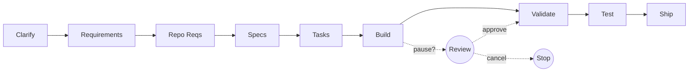

<div align="center">

# Anvil

**AI agents that ship features across multi-repo codebases**

[](https://github.com/esanmohammad/Anvil)
[](LICENSE)
[](https://modelcontextprotocol.io)
[]()

[Pipeline](#anvil-pipeline) · [Code Search](#code-search-mcp) · [Quick Start](#quick-start) · [Docs](#configuration) · [Demo](https://drive.google.com/file/d/1xsJWrYI5C6aaoE5_n4DbOTaFie1L2d7G/view?usp=drive_link)

<br />

[](https://drive.google.com/file/d/1xsJWrYI5C6aaoE5_n4DbOTaFie1L2d7G/view?usp=drive_link)

_Click the gif to watch the full demo_

</div>

---

## What's New — 2026-04-23

**Confidence-gated pipeline, test generation, and bug-to-test replay — all shipped today.**

- **Plan → pause → review → go** — policy-configurable pause between stages with risk scoring, plan review UI, Slack/email approve links, and CODEOWNERS-routed multi-reviewer quorum.
- **Cost ceilings with live override** — agents keep running during a grace window; you raise the limit with one click or reject to stop. Rejected runs preserve a checkpoint for resume later.
- **Deterministic agent checkpoints** — every persona call is keyed by a stable hash of its inputs. Re-runs replay only uncompleted work. Typical savings: 30–70% on retries.
- **Test Gen** — behavior-driven spec with contract tests, mutation testing, flakiness quarantine, coverage SLAs, and per-persona review.
- **Bug-to-test replay** — paste a stack trace (or wire Sentry / incident.io webhook) → Anvil reproduces, generates a regression test, binds it to the file, and opens a PR annotation so the test can't silently disappear.

See [Confidence-Gated Pipeline](#confidence-gated-pipeline-new) for the full design and env flags.

---

<table>
<tr>
<td width="50%" valign="top">

### Anvil Pipeline

**Describe a feature -- get PRs across all repos.**

A 9-stage pipeline driven by AI agents with full architectural awareness: AST-parsed knowledge graphs, cross-repo dependency detection, convention learning, cost-controlled model routing, and opt-in confidence-gated pauses.

[Get started](#quick-start)

</td>
<td width="50%" valign="top">

### Code Search MCP

**11 MCP tools for any AI client.**

A standalone MCP server that gives Claude Code, Cursor, or any MCP client semantic search, dependency graphs, cross-repo analysis, and impact tracing over your codebase.

[Get started](#code-search-mcp)

</td>
</tr>
</table>

---

## Quick Start

**Install from npm (recommended):**

```bash
npm install -g @esankhan3/anvil-cli
anvil doctor
anvil dashboard
```

**Or clone and build from source:**

```bash
git clone https://github.com/esanmohammad/Anvil.git && cd anvil
npm install && npm run build --workspaces
./packages/cli/dist/index.js dashboard
```

Open `http://localhost:5173`, select your project, and describe what you want to build.

- **Node.js >= 20**
- **git** and **gh** (GitHub CLI) for PR creation
- **Claude CLI** (`npm i -g @anthropic-ai/claude-code`) -- primary agent provider
- **Gemini CLI** (optional) -- alternative provider

---

## Anvil Pipeline

**Describe a feature. Anvil clarifies, plans, codes, tests, and opens PRs -- across every repo in your project.**



| Stage | What happens |
|:--|:--|
| **Clarify** | Agent explores the codebase, asks targeted questions, you answer in the dashboard |
| **Requirements** | High-level cross-repo plan: architecture, scope, success criteria |
| **Repo Requirements** | Per-repo breakdown with data flows, API changes, inter-service deps |
| **Specs** | Technical specs per repo: API contracts, schemas, migrations |
| **Tasks** | Granular implementation tasks with file-level scope and execution order |
| **Build** | Agents write code on feature branches, parallel across independent repos |
| **Validate** | Build, lint, test -- automatic fix loop (up to 5 iterations) |
| **Test** | Behavior-driven spec → cases → runs with flakiness quarantine + mutation scoring |
| **Ship** | Commit, push, open cross-linked PRs on GitHub |

Each stage is checkpointed to `~/.anvil/features/`. Six agent personas (Clarifier, Architect, Analyst, Engineer, Tester, Lead) are assigned per stage. Model routing uses cost tiers -- $/$$/$$$ -- overridable per stage in `factory.yaml`. The dotted branch shows the [confidence-gated pipeline](#confidence-gated-pipeline-new) — opt-in pauses driven by your project's policy.

---

## Confidence-Gated Pipeline <a id="confidence-gated-pipeline-new"></a>

Auto-mode is a feature for simple tasks; for anything touching auth, migrations, or cross-service contracts you want a quick human checkpoint before spending 30 minutes of agent time on the wrong plan. Anvil now ships a nine-module policy engine that puts that checkpoint exactly where you want it — and nowhere else.

**All features are opt-in via env flags.** Existing runs are unchanged until you turn them on.

### Phase 1 — Plan risk scorer

Every generated plan is scored 0→1 across weighted factors: file count, LOC delta, sensitive paths (`auth/**`, `migrations/**`, `infra/**`, `.env*`, `secrets/**`), new dependencies, cross-package scope, touches-api-contracts, and inverse of agent self-confidence. Output: `tier: 'low' | 'med' | 'high'` plus an explainable factor list shown in the review UI.

### Phase 2 — Policy config (`pipeline-policy.yaml`)

Declarative rules in `~/.anvil/projects/<slug>/pipeline-policy.yaml`:

```yaml
version: 1.0.0
defaults:
  pauseAfter: [plan]
  autoApproveIfRisk: low
  autoApproveIfConfidence: 0.85
paths:
  - match: "**/auth/**"
    pauseAfter: [plan, review]
    reviewers: ["@security-team"]
  - match: "**/migrations/**"
    pauseAfter: [plan, implement, review]
  - match: "docs/**"
    pauseAfter: []
cost:
  limits: { perRun: 3.00, perProjectDaily: 50.00 }
  graceWindowSeconds: 120
  onBreach: ask
  autoApproveBelow: 0.50
notifications: { slack: true, timeoutHours: 24 }
```

Scaffold with `anvil policy init`, validate with `anvil policy validate`, pretty-print with `anvil policy show`.

### Phase 3 — Pause / resume primitives

When a pause fires, the pipeline writes to `~/.anvil/pipeline-pauses/<project>/<runId>.json` (atomic tmp+rename), broadcasts `pipeline-paused` over WebSocket, and **blocks** until the user decides. A background sweeper times-out stale pauses per `timeoutHours`. Resume decisions are one of `approve`, `modify` (edit plan JSON inline), `replan-with-note`, `cancel`.

### Phase 4 — Paused run UI

Dashboard gains a modal that shows: risk breakdown (color-coded), token/USD estimate, KB grounding citations, predicted diff (dry-run, no implement), countdown timer, four action buttons, and keyboard shortcut `A` for approve. Renders a pulsing "Paused — awaiting user" card inline in Active Runs.

### Phase 5 — Notifications + approve-by-link

Slack block-kit messages with two buttons: **Approve** (HMAC-signed token hits `/api/pipeline/approve?token=...`) and **Review in dashboard**. Tokens are 24h, `timingSafeEqual` verified. Email is stubbed behind `ANVIL_SMTP_URL`. Escalation sweeper re-notifies a fallback reviewer after N hours.

### Phase 6 — Learning loop

Every approve/modify/reject becomes a record. Insights page shows approval rate, modification rate, per-path rejection rate, top rejection reasons, and avg decision latency. A calibrator suggests path-weighted risk multipliers based on rejection patterns — so the scorer gets smarter over time.

### Phase 7 — Team mode

- CODEOWNERS parser (supports `**`, `*`, `?`, leading `/`, directory rules, group tags, last-match-wins) auto-routes paused plans to the right reviewers.
- N-of-M approval quorum; any reject vetoes.
- Append-only NDJSON audit log with 5 MB rotation: `paused`, `approved`, `rejected`, `modified`, `reassigned`, `escalated`, `timed-out`.

### Phase 8 — Cost ceilings with live override

The important choice: **a cost breach does not stop the agents.** Instead:

1. Spend crosses the limit → breach state written, Slack/UI ping fires.
2. A grace window (default 120s) starts. **Agents keep running.**
3. You click **Raise by $X** — limit increases, no interruption.
4. You click **Reject** — SIGTERM to in-flight agents; Phase 9 flushes a checkpoint; run transitions to `paused-cost-rejected` so you can resume later with a new budget.
5. No decision? Grace expires → policy-default applies (`ask` re-prompts; `auto-approve` silently raises if overage ≤ `autoApproveBelow`; `auto-reject` halts).

Ledger is NDJSON append-only per run and per day; pricing is hard-coded for Opus / Sonnet / Haiku with Sonnet fallback for unknowns.

### Phase 9 — Deterministic agent checkpoints

Every persona invocation is keyed by `sha256(runFamily + stage + taskId + promptVersion + model + toolVersions + fingerprint(inputs))`. The wrapper checks the cache before spawning; on a hit it serves the cached output and emits a synthetic done-event. On SIGTERM (cost reject or user cancel) it writes `status: 'interrupted'` atomically so the next resume picks up exactly where work stopped.

Blobs are content-addressed (`~/.anvil/checkpoints/_blobs/<sha[0:2]>/<sha>`) with fan-out dedup across runs. Manage with:

```bash
anvil checkpoints stats --project demo
anvil checkpoints invalidate --run run-42 --stage review
anvil checkpoints gc --older-than 30d
```

### Enable it

Three independent flags — flip any subset:

| Env var | Effect |
|:--|:--|
| `ANVIL_POLICY_ENABLED=1` | Pipeline consults policy after each stage; paused runs block for human decision. |
| `ANVIL_COST_LIMITS_ENABLED=1` | Every LLM call lands in the ledger; breach triggers the grace-window flow. |
| `ANVIL_CHECKPOINTS_ENABLED=1` | Every agent spawn consults the cache; hits skip the subprocess. |

```bash
anvil policy init
ANVIL_POLICY_ENABLED=1 \
ANVIL_COST_LIMITS_ENABLED=1 \
ANVIL_CHECKPOINTS_ENABLED=1 \
  anvil dashboard
```

Optional: set `ANVIL_DASHBOARD_URL` so Slack approve-links resolve to the right host.

---

## Test Gen & Bug-to-Test Replay

**Test Gen** lives at `/tests` in the dashboard. Describe the feature → Anvil authors a `TestSpec` with behaviors (unit / contract / regression), expands behaviors into executable cases, runs them via the project's real runner (vitest / jest / mocha / pytest / go test), and reports per-case verdicts with raw runner output.

- **Per-persona review**: test-architect, edge-case-hunter, security-tester, perf-tester, flakiness-auditor — run in parallel, produce findings you can dismiss / apply-fix / mark-addressed / mark-won't-fix.
- **Mutation testing** via a Stryker wrapper surfaces mutation-survival rate per file.
- **Flakiness quarantine**: failing cases are re-run twice; intermittent failures get tagged and tracked in per-project learnings.
- **Coverage SLAs**: enforce minimum line / branch coverage, fail the run if breached.

**Bug-to-test replay** is the "Incidents" tab of the same page. Three ingestion surfaces:

1. **Manual**: paste a stack trace → normalized + deduped via content hash.
2. **CLI**: `anvil incidents replay --sentry-issue <url>` / `--incidentio-id <id>` / `--stack <file>`.
3. **Webhooks**: HMAC-signed endpoints `POST /api/incidents/webhook/{sentry,incidentio,generic}`.

Once ingested, Anvil locates the fix commit (`gh pr view --json mergeCommit`), sets up two git worktrees (pre-fix + post-fix), authors a regression test that **fails** in pre-fix and **passes** in post-fix, and registers the test file in `bound-tests.json`. Bound tests are:

- Annotated in PRs that touch them ("anvil-regression — DO NOT DELETE without override")
- Blocked from deletion without an explicit override reason (logged in append-only `audit.log`)
- Slack-nudged when confidence is low or override is used

This makes every fixed bug leave behind a permanent regression guard, automatically.

---

## Key Features

<table>
<tr>
<td width="50%" valign="top">

**Knowledge Graph**

AST parsing extracts functions, classes, imports, and relationships into `graph.json` per repo. 14 cross-repo edge detection strategies cover npm workspaces, shared types, HTTP routes, Kafka topics, gRPC services, database tables, and more. Interactive force-directed visualization in the dashboard.

</td>
<td width="50%" valign="top">

**Memory and Learning**

Auto-learns from successes, failures, and fix patterns after every pipeline run. Project memory and user profile persist across runs and are injected into agent prompts, so future runs improve without manual tuning.

</td>
</tr>
<tr>
<td width="50%" valign="top">

**Resilience and Recovery**

Every stage is checkpointed. Resume after crash, sleep, budget hit, or manual stop -- full context restored. Interrupted pipelines appear in Active Runs on dashboard restart.

</td>
<td width="50%" valign="top">

**Convention Detection**

Automatically extracts file naming patterns, test conventions, import ordering, and error handling styles. Rules graduate from detected to validated to enforced as confidence increases.

</td>
</tr>
<tr>
<td width="50%" valign="top">

**Budget Controls & Cost Ceilings**

Per-run and daily spend limits with browser notifications. Opt-in **live-override** mode (`ANVIL_COST_LIMITS_ENABLED=1`) keeps agents running during a grace window so you can raise the limit without losing work — or reject to stop with a resumable checkpoint.

</td>
<td width="50%" valign="top">

**Auth Recovery**

If your LLM provider auth expires mid-pipeline, the pipeline pauses, sends a browser notification, auto-opens re-login, and resumes once authenticated. No lost work.

</td>
</tr>
</table>

---

## Code Search MCP

A standalone MCP server that gives any MCP client deep understanding of your codebase. Point it at a directory or GitHub org -- it discovers repos, parses code with tree-sitter, builds vector embeddings, constructs AST graphs, and detects cross-repo dependencies.

**Install for Claude Code:**

```bash
claude mcp add code-search -- npx @esankhan3/code-search-mcp --local /path/to/repos
```

**Tool categories:**

Search: `search_code`, `search_semantic`, `search_exact` | Graph: `get_repo_graph`, `get_cross_repo_edges` | Navigation: `find_callers`, `find_dependencies`, `impact_analysis` | Info: `list_repos`, `get_repo_profile`, `index_status`

Full docs: [`packages/code-search-mcp/README.md`](packages/code-search-mcp/README.md)

---

## Privacy

**Zero telemetry. Zero logging. Zero phone-home.**

- Fully local -- dashboard, pipeline, knowledge graph, and indexing all run on your machine
- You choose the LLM -- your code only goes to the provider you explicitly select
- Open source MIT -- every line auditable, no obfuscated binaries

---

## Configuration

A single `factory.yaml` in `~/.anvil/projects/<name>/` configures the pipeline:

```yaml
version: 1
project: my-platform
workspace: ~/workspace/my-platform

repos:
  - name: api-gateway
    path: ./api-gateway
    language: go
    github: myorg/api-gateway
    commands:
      build: make build
      test: make test

budget:
  max_per_run: 50
  max_per_day: 150

pipeline:
  models:
    clarify: claude-sonnet-4-6
    build: claude-sonnet-4-6
```

Providers: **Claude CLI** (up to 1M context on Opus 4.7 / Sonnet 4.6 / Opus 4.6, 200K on Haiku 4.5) and **Gemini CLI** (1M context). Both run full tool use. Additional providers planned.

Context windows are resolved per-model via a family-rule catalog (`packages/dashboard/server/model-catalog.ts`) — no per-version hardcoding. Override any model with `ANVIL_CONTEXT_WINDOW_<MODEL_ID>=<tokens>` if you're on a custom endpoint.

| Command | Description |
|:--|:--|
| `anvil init` | Scaffold a new project with `factory.yaml` |
| `anvil doctor` | Check Node.js, git, gh, and provider availability |
| `anvil dashboard` | Launch the web dashboard |
| `anvil plan` | Generate / show / compare structured plans |
| `anvil review` | List / resolve findings from the Review flow |
| `anvil test` | Generate test specs, run cases, show coverage |
| `anvil incidents` | Ingest stack traces / Sentry / incident.io, replay bugs as regression tests |
| `anvil policy init / validate / show` | Manage the per-project confidence-gate policy |
| `anvil cost show / raise / reject` | Inspect spend, raise a limit live, or reject a breached run |
| `anvil checkpoints stats / invalidate / gc` | Inspect the deterministic agent-checkpoint cache |

---

## Contributing

```bash
git clone https://github.com/esanmohammad/Anvil.git && cd anvil
npm install && npm run build --workspaces
cd packages/dashboard && npm run dev      # dashboard dev mode
cd packages/code-search-mcp && node build.mjs  # build MCP server
```

## Packages

Published on npm — install directly, no build step needed.

| Package | Install | What it is |
|:--|:--|:--|
| [`@esankhan3/anvil-cli`](https://www.npmjs.com/package/@esankhan3/anvil-cli) | `npm i -g @esankhan3/anvil-cli` | CLI + dashboard bundled together. Provides the `anvil` command (`init`, `doctor`, `dashboard`). [README](packages/cli/README.md) |
| [`@esankhan3/code-search-mcp`](https://www.npmjs.com/package/@esankhan3/code-search-mcp) | `npx @esankhan3/code-search-mcp` | Standalone MCP server for multi-repo code search, AST graphs, and cross-repo impact analysis. Works with any MCP client. [README](packages/code-search-mcp/README.md) |

> **`packages/dashboard`** is an internal monorepo source folder — its compiled output (React bundle + Node server) is bundled inside `@esankhan3/anvil-cli` and published together. It is not published as a standalone npm package.

## License

MIT -- Copyright (c) 2024-2026 Esan Mohammad

<div align="center">

Built with [TypeScript](https://www.typescriptlang.org/) | [React](https://react.dev/) | [Tree-sitter](https://tree-sitter.github.io/) | [LanceDB](https://lancedb.com/) | [Graphology](https://graphology.github.io/)

[Issues](https://github.com/esanmohammad/Anvil/issues) · [Discussions](https://github.com/esanmohammad/Anvil/discussions)

</div>
